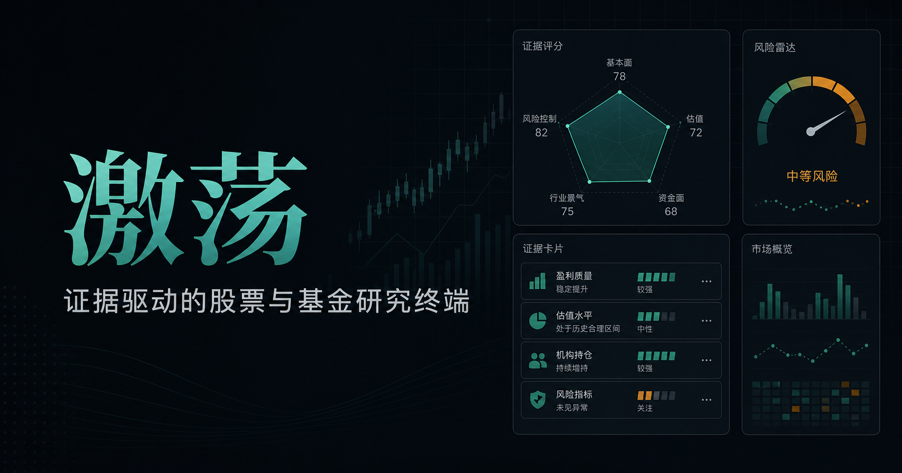

# 激荡（Jidang）

面向小规模邀请制使用的 A 股模拟研究与国内公募基金研究终端。项目把公开市场数据、规则化筛选、风险约束和 DeepSeek 证据解释整合到一份可追溯的个人研究报告中。

> **重要声明**
>
> 本项目仅用于投资研究、数据分析和风险教育，不构成投资建议，不连接券商，也不会自动下单。历史收益、规则评分、AI解释和观察区间都不能保证未来表现。



## 项目定位

激荡不是“自动荐股机器人”。它遵循三个基本原则：

1. **先验证证据，再形成观点**：行情、财务、估值、公告、新闻和政策分别保留来源、时间和局限。
2. **程序负责计算，AI负责解释**：收益、回撤、评分、候选资格和配置比例由确定性规则生成，DeepSeek 不得修改这些结果。
3. **允许没有候选**：证据不足或风险门槛不通过时，系统应明确等待，而不是为了凑数量强行推荐。

## 核心能力

| 模块 | 当前能力 |
| --- | --- |
| 账户与隐私 | 邀请制账户、首次改密、登录限流、管理员建号/停用/重置密码；自选、画像、报告和账本按用户隔离 |
| 风险画像 | 每个账户独立填写资金、期限、经验、最大回撤和禁投范围，并保留版本 |
| 市场数据 | 查询 A 股、ETF 和国内公募基金；读取股票/ETF历史日线和基金历史净值 |
| 基本面 | 股票财务摘要与公告入口；基金基础资料、费率、业绩比较基准和最近披露持仓 |
| 估值与事件 | 股票历史估值分位、同日同行比较、基金持仓穿透估值、新闻线索分级和证监会政策入口 |
| 规则研究 | 5/20/60日收益、波动率、最大回撤、均线、ATR14、六维评分和风险硬门槛 |
| 个人报告 | 合并私人自选池与公共市场初筛，生成版本化、带完整性摘要的锁定报告 |
| DeepSeek | 每份报告最多调用一次，只解释带编号、链接和日期的证据；失败时自动降级，不影响程序结论 |
| 本地调度 | 交易日前夜报告、盘前补充和周度复盘任务入口；带任务幂等和本地运行日志 |

### 研究期限与边界

- A 股和场内 ETF：只做 **1—2周模拟研究**。
- 场外公募基金：按 **3—12个月中期观察**，不强行套用股票短线逻辑。
- 单份报告最多保留 3 个 A 股/ETF 模拟候选和 2 个基金候选。
- 公开免费数据只适合研究验证，不能替代交易所、基金公司或券商终端核价。

## 当前完成度

截至 2026-09-13，本地版本已经完成并验证：

- 账户、风险画像、自选池、报告和账本的服务端数据隔离；
- 股票、ETF、基金的公开数据查询和规则化指标计算；
- A 股短期模型与场外基金中期模型分流；
- DeepSeek真实报告调用、结构化JSON校验、截断拒绝、Token记录和失败降级；
- 个人报告保存、版本号、完整性摘要和锁定机制；
- 44项自动测试、生产构建和代码规范检查；
- 本地晚间任务多次真实执行成功，最近一次于 2026-09-13 20:03 生成 2026-09-14 报告。

### 已知未完成项

| 项目 | 实际状态 |
| --- | --- |
| 交易账本界面 | 后端读写接口已存在；“新增记录”按钮、录入表单、记录列表和收益统计尚未接通 |
| 顶部市场状态 | “A股已收盘”目前是固定文案，尚未按上海时间、午休和交易日历动态判断 |
| 08:30盘前补充 | 能追加记录且不覆盖前夜报告，但真实隔夜新闻增量核验尚未完成 |
| 周度复盘 | 任务和空样本保护已实现，连续样本绩效统计尚未完成 |
| 本地20:00调度 | 已有多次真实成功记录，但依赖Windows登录和不休眠，部分执行发生在20:03、20:30或更晚，不能声称严格准点 |
| AI月度预算 | 记录Token并限制每日请求次数；`AI_MONTHLY_BUDGET_CNY` 目前只是预算目标，不是服务商账单硬上限 |
| 云端部署 | 当前只在本地运行；尚未完成中国大陆服务器、域名、ICP备案和生产数据库适配 |

## 技术栈

- React 19、TypeScript、Vinext、Vite
- Cloudflare Worker 兼容运行时
- Drizzle ORM、D1/SQLite
- DeepSeek Chat Completions API
- Node.js 内置测试框架、ESLint
- Windows PowerShell 本地启动与调度脚本

## 本地运行

### 环境要求

- Windows 10/11
- Node.js `>= 22.13.0`
- npm
- PowerShell 5.1 或 PowerShell 7

### 1. 克隆并安装

```powershell
git clone https://github.com/Krick-code/jidang-research-terminal.git
cd jidang-research-terminal
npm ci
```

该仓库是私有仓库，克隆前需要登录有权限的 GitHub 账号。

### 2. 配置本地环境

```powershell
Copy-Item .env.example .dev.vars
```

然后只在本机编辑 `.dev.vars`。至少保留以下结构：

```dotenv
DEEPSEEK_API_KEY=
TUSHARE_TOKEN=
AI_MONTHLY_BUDGET_CNY=50
AI_DAILY_REQUEST_LIMIT=10
PUBLIC_ORIGIN=http://localhost:3000
```

- `DEEPSEEK_API_KEY`：可选；为空时AI解释层会明确降级。
- `TUSHARE_TOKEN`：可选增强项；当前免费市场查询不依赖它。
- `TASK_SECRET`：无需手工填写，启动脚本会在本地生成并维护。
- `.dev.vars` 已被 Git 忽略，禁止提交真实密钥。

### 3. 初始化数据库

```powershell
npx wrangler d1 migrations apply site-creator-d1 --local
```

### 4. 启动程序

```powershell
npm run dev
```

打开：<http://127.0.0.1:3000/>

首次使用时由页面创建第一个管理员账户。项目没有预置通用管理员密码。

## 本地定时任务

注册当前Windows用户的启动项：

```powershell
powershell -ExecutionPolicy Bypass -File .\scripts\register-startup.ps1
```

调度器计划：

- 每天20:00：检查次日是否为交易日，必要时生成前夜报告；
- 工作日08:30—09:15：追加盘前风险补充；
- 每周六20:00：生成周度复盘。

运行证据保存在：

- `.local-runtime/scheduler.log`
- `.local-runtime/task-events.jsonl`

本地调度不是云服务。电脑关机、休眠、退出当前Windows账户或服务启动失败时，任务不会可靠执行。

## 验证

完整测试：

```powershell
npm test
```

代码规范检查：

```powershell
npm run lint
```

生产构建：

```powershell
npm run build
```

当前自动测试覆盖规则指标、候选硬门槛、账户隔离、交易日历、任务幂等、DeepSeek JSON兼容和报告证据约束。测试通过不等于免费数据源长期稳定，也不等于投资策略具备真实盈利能力。

## 数据与AI边界

- 股票与ETF历史指标使用前复权收盘价；基金使用累计净值。
- 股票财务摘要来自第三方结构化公开资料，形成结论前仍应回看公司正式定期报告。
- 基金季度持仓不是当前持仓，前十大持仓合计不等于基金股票总仓位。
- 新闻的公告主题匹配只能证明主题相关，不能证明报道中的每个数字和因果关系。
- 历史估值分位和同行分位只是相对尺度，不等于“低估”“高估”或目标价。
- DeepSeek最多接收30条结构化证据；无有效证据、超时、返回截断或JSON校验失败时，系统保留规则结果并标记降级。
- 评分是透明规则的汇总，不是上涨概率。

## 安全说明

- 密码使用 PBKDF2-SHA256（210,000次）加盐哈希。
- Session Cookie 使用 `HttpOnly` 和 `SameSite=Strict`；HTTPS环境额外启用 `Secure`。
- 私人数据通过服务端 `user_id` 约束隔离。
- 本地数据库、运行日志、API密钥和任务密钥均被 `.gitignore` 排除。
- 服务器控制者仍可能在运维层访问数据库；应用内隔离不等于对服务器管理员加密。
- 不上传券商账号、身份证、银行卡、交易密码或其他敏感资料。

## 项目结构

```text
app/        页面、组件与API路由
db/         Drizzle数据模型和数据库入口
drizzle/    D1/SQLite迁移文件
lib/        市场数据、指标、报告、AI与调度逻辑
scripts/    Windows本地启动和调度脚本
tests/      自动测试
docs/       部署边界与准备说明
public/     静态资源
worker/     Cloudflare Worker入口
```

## 部署

当前仓库只证明本地MVP和Cloudflare兼容构建可运行，不代表已经在中国大陆正式上线。国内部署还需要服务器、域名、ICP备案、HTTPS、生产数据库、备份恢复和真实任务监控。

详细要求见：[中国大陆部署说明](docs/DEPLOYMENT_CN.md)。

## 开发原则

提交新功能前至少满足：

1. 不把缺失数据伪装成零或低风险；
2. 不允许AI覆盖确定性计算与风险门槛；
3. 私人读写必须绑定当前登录用户；
4. 报告发布后只能追加跟踪，不能无痕覆盖；
5. 新增专业术语时提供通俗解释和计算局限；
6. 只有真实运行日志能证明定时任务完成。
